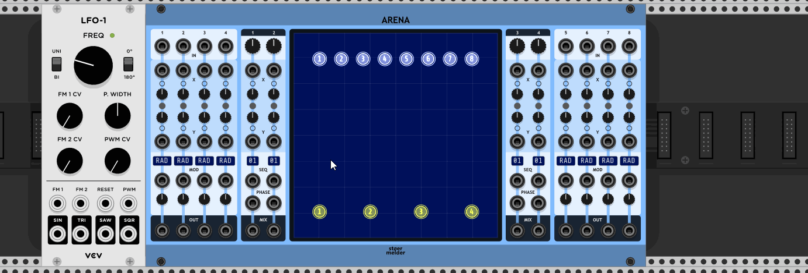
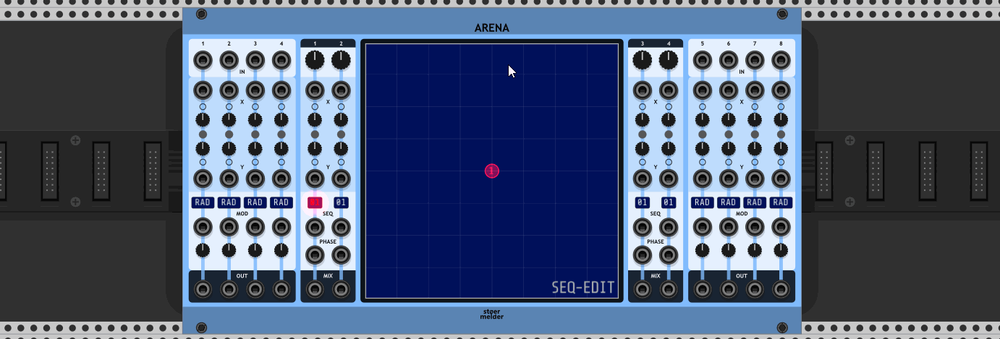
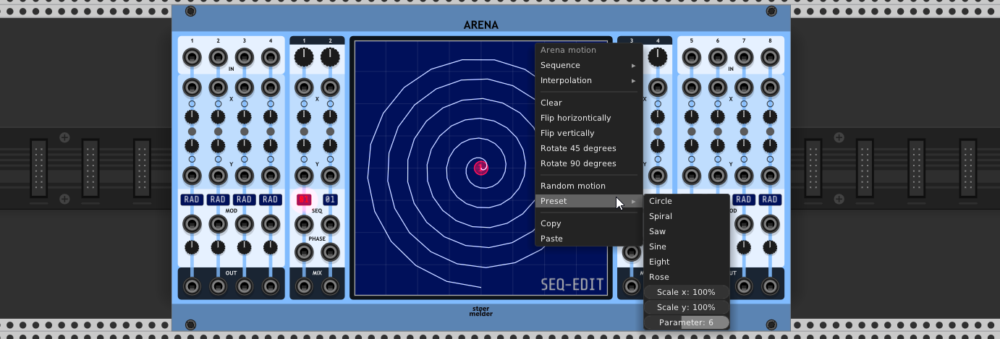

# stoermelder ARENA

ARENA is a two-dimensional mixer with 8 inputs with 8 assigned outputs, 4 mixed outputs with 16 motion sequences each and various modulation options. In the center of the module is the colorful screen that visualizes the positions of the inputs and outputs in two-dimensional space and their modulated parameters.

### SEQ-ports and PHASE-ports

Each of the 4 mixed outputs can be motion sequenced with up to 16 different motion paths. To enter to edit mode click on the number-display of the mixing-channel. In edit mode the display is lit in red and the center screen shows "SEQ-EDIT" in the bottom corner. The start point of the motion is set by a left mouse click, the motion is recorded by mouse movement with held down left mouse button. To exit the edit mode click again on the number-display

Additionally there are some predefined motion paths that can be scaled in x/y-directions and can be parameterized if available, like cirlces, saws or spirals. A random path can also be generated. 

There are some edit options available to modify a recorded path or one of the presets: flip horizontically or flip vertically and rotate. Also a path can be copied and pasted to another sequencing slot.

The SEQ-input allows you to select a sequence by CV. There are several different modes available:

- Trigger forward (Default): When a trigger is received the module advances to the next sequence.
- Trigger reverse:  When a trigger is received the module advances to the previous sequence.
- Trigger random 1-16, 1-8 or 1-4: When a trigger is received the module advances to a random sequence within the selected range.
- 0..10V : The range is splitted evenly by 8. 0-1.25V selects sequence 1, 1.25-2.5V sequence 2 and so on.
- C4-D#5: Keyboard mode, C4 triggers sequence 1, D#4 triggers sequence 16.

The input labeled PHASE accepts 0-10V and allows controlling the position of the output on the currently selected motion path: The voltages from 0 to 10V are mapped to the the length of the sequence. Using an LFO's unipolar saw output or a clock with phase output like [ZZC's Clock-module](https://zzc-cv.github.io/en/clock-manipulation/clock) the motion can synced to sequencers and you get looping behavior, an LFO with triangle-output gives you a ping ping-motion.

This module was added in v1.3.0 of PackOne.