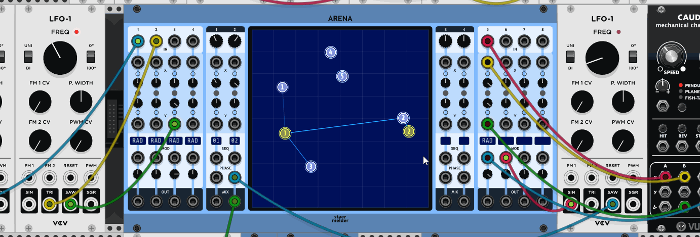
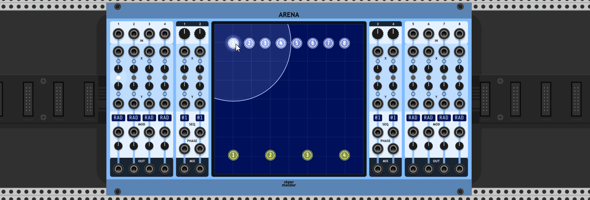
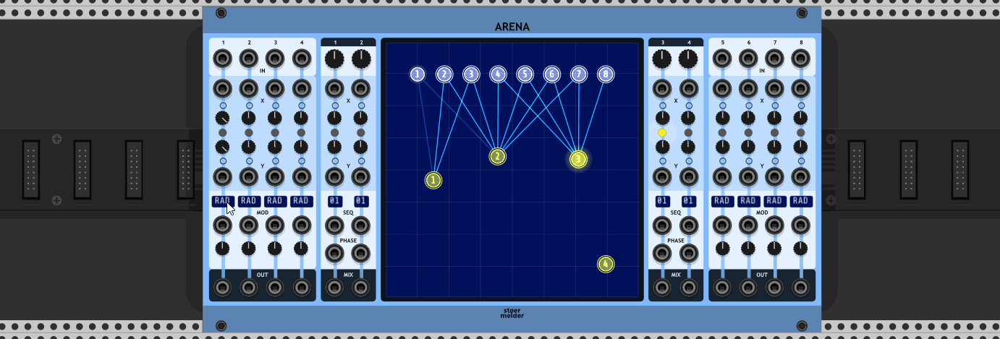
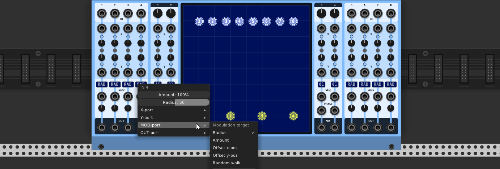
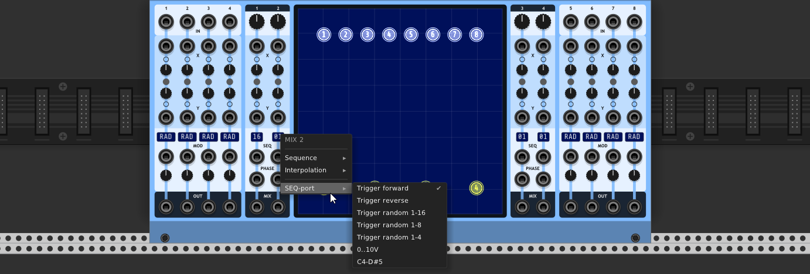

# stoermelder ARENA

ARENA is a two-dimensional mixer with 8 inputs with 8 assigned outputs, 4 mixed outputs with 16 motion sequences each and various modulation options. In the center of the module is a big colorful screen that visualizes the positions of the inputs and outputs in two-dimensional space and their modulated parameters.

The module produces no signal on its own.

### IN-ports and OUT-ports

The module has 8 input-ports with assigned controls for "Amount" and "Radius" and are routed their output-ports respectively. The signal sent to the OUT-port is calculated in this way: The amount is used to scale the input linearly between 0-100%. The radius defines the range of influence of the input-signal according to the euclidian distance between each of the MIX-objects in 2d-space considering the x/y coordinates of the objects. These weighted distances are summed in repect of one of the following OUT-modes:

- Scale: Each MIX-port brings in at most 100/n% of the input-signal if n MIX-ports are active, so the output can reach 100% at most.
- Limit: Each MIX-port brings in at most 100% of the input-signal and the output is limited at 100% of the input.
- Clip -5..5V / 0..10V: Each MIX-port brings in at most 100% of the input-signal, the sum can be >100% but the output is limited on -5..5V or 0..10V
- Fold -5..5V / 0..10V: Each MIX-port bringt in at most 100% of the input-signal, the sum can be >100% but the output if folded on -5..5V or 0..10V.

For visualization on the screen, a line is drawn between a white (input) and yellow (mix) circle if the input is in range according to the radius. The brightness of the outer circle and the connecting line visuals the current amount-value for the input.

### MOD-ports

For further modulation of the input-signals each channel has a MOD-input that can be used for different modulation targets selected and shown in the channels text-display:

- RAD / Radius (Default): The radius of an input determines the range within 2d-space in which the signal is sent to OUT-port and MIX-port.
- AMT / Amount: The amount determines how much of the input signal is entering the signal-path of ARENA.
- O-X, O-Y / Offset x-pos, y-pos: The offsets for x/y-coordinates can be used in addition to the X/Y-ports to offset one of the CV-signals. 
- WLK / Random walk: The position of the input in 2d-space is randomly modified.

### MIX-ports

### SEQ-ports and PHASE-ports

Each of the 4 mixed outputs can be motion sequenced with up to 16 different motion paths. To enter to edit mode click on the number-display of the mix-channel. In edit mode the display is lit in red and the center screen shows "SEQ-EDIT" in the bottom corner. The start point of the motion is set by a left mouse click, the motion is recorded by mouse movement with held down left mouse button. To exit edit-mode click again on the number-display.

Additionally there are some predefined motion paths that can be scaled in x/y-directions and can be parameterized if available, like cirlces, saws or spirals. A random path can also be generated. 

There are some edit options available to modify a recorded path or one of the presets: flip horizontically or flip vertically and rotate. Also a path can be copied and pasted to another sequencing slot.

The SEQ-input allows you to select a sequence by CV. There are several different modes available:

- Trigger forward (Default): When a trigger is received the module advances to the next sequence-slot.
- Trigger reverse:  When a trigger is received the module advances to the previous sequence-slot.
- Trigger random 1-16, 1-8 or 1-4: When a trigger is received the module chooses a random sequence-slot within the selected range.
- 0..10V: The range is splitted evenly by 8. 0-0.625V selects sequence-slot 1, 0.625-1.25V sequence-slot 2 and so on.
- C4-D#5: Keyboard mode, C4 triggers sequence-slot 1, D#5 triggers sequence-slot 16.

The input labeled PHASE and be set to accept -5..5V or 0..10V and allows controlling the position of the output on the currently selected motion path: The input-voltage is mapped to the length of the sequence. Using an LFO's unipolar saw output or a clock with phase output like [ZZC's Clock-module](https://zzc-cv.github.io/en/clock-manipulation/clock) the motion can synced to sequencers and you get looping behavior, an LFO with triangle-output gives you a ping ping-motion.

### X/Y-mapping

This module was added in v1.3.0 of PackOne.