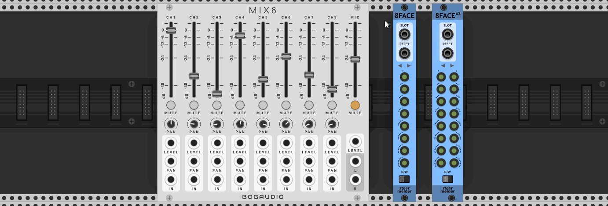
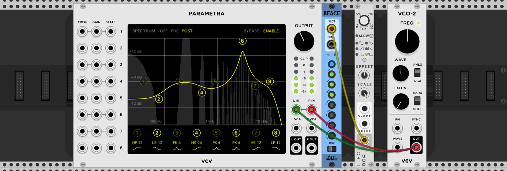
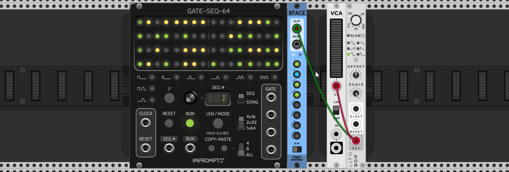

# stoermelder 8FACE

8FACE is a module for storing, recalling and sequencing up to eight different presets of any module in Rack. It uses Rack's expander mechanism to attach to any module to its left and uses buttons and LEDs to manage each of its preset-slot.

**Disclaimer: Loading presets of modules was not designed to be controlled by CV or modulated at audio rate. Please do not contact the developers of Rack or any modules when unexpected behaviour occurs or high CPU usage is noticeable.**

### Usage

Place 8FACE on the right side next to the module you like to manage. The LED between the directional triangles begins to flash if a connection is established successfully. You can detach 8FACE and re-attach to another instance of the same module. When you place 8FACE next to a module and the LED turns red it means it had been configured for another model. In this case you can either check the model on the context menu or initialize 8FACE to its initial state.

### Write-Mode

Write-mode is used to save presets in 8FACE. You enter write mode by flipping the switch on the bottom to the "W"-position. To store a preset simply configure your module left of 8FACE and then short press a slot-button numbered 1 to 8. The LEDs next to the slot-button turn red when a slot is already in use. To clear a slot long-press a button. In write-mode any input in SLOT is ignored and sequencing is disabled.

### Read-Mode

Read-mode is enabled by default and can be selected by the switch on the bottom in "R"-position. LEDs lit in bright green signal slots in use, dim green slots are active but empty. A blue LED marks a slot which preset is currently applied to the module on the left. You can manually apply a preset with a short-press.

### SLOT-port

The fun begins when you use the port labelled "SLOT" for selecting preset slots by CV. Although there are eight slots available it is possible to use less slots for sequencing: You can adjust the number of useable slots by long-pressing a slot-button while in read-mode. The LED turns off completely for slots that are currently disabled.

There are different modes for SLOT-port available, configured by context menu option:

- Trigger forward:
A trigger on SLOT advances 8FACE to the next slot. Empty slots are part of the sequence but won't have any effect on the controlled module.

- Trigger reverse (added in v1.1.0):
Same as "Trigger forward", but reverse direction.
- Trigger pingpong (added in v1.1.0):
Same as "Trigger forward", but loops first forward then reverse.
- Trigger random (added in v1.1.0):
Same as "Trigger forward", but chooses the next preset randomly.
- 0..10V:
You can select a specific slot by voltage. A voltage 0-1.25V selects slot 1, 1.25-2.5V selects slot 2, and so on if all eight slots are active. Keep in mind that adjusting the length of the sequence also adjusts the voltage range for selecting individual slots: A sequence with length 2 will select slot 1 on voltage 0-5V etc.
- C4-G8: 
This mode follows the V/Oct-standard. C4 selects slot 1, C#4 selects slot 2 and so on.
- Arm (renamed from "Clock" in v1.1.0):
This mode is kind a sample and hold. First apply a clock signal on SLOT. Then you "arm" any slot manually by its button (resulting a yellow LED) which will be activated on the next clock trigger (blue LED). This mode allows you manual preset changes sychronized to a beat or clock.

With the option "Autoload first preset" on the context menu you can autoload the first preset slot when a preset of 8FACE itself is loaded. This is useful when changing presets of 8FACE with another 8FACE module to get 64 preset slots.

This module was added in v1.0.5 of PackOne.
