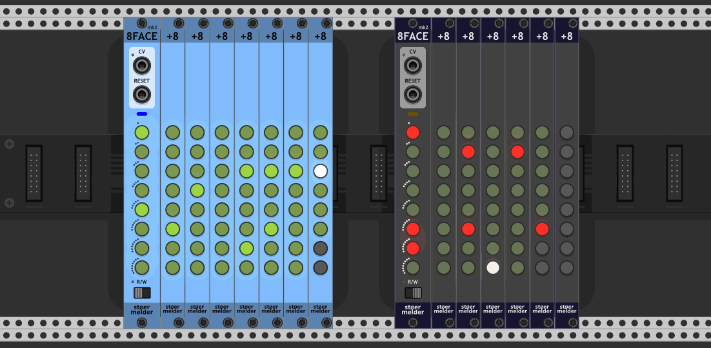
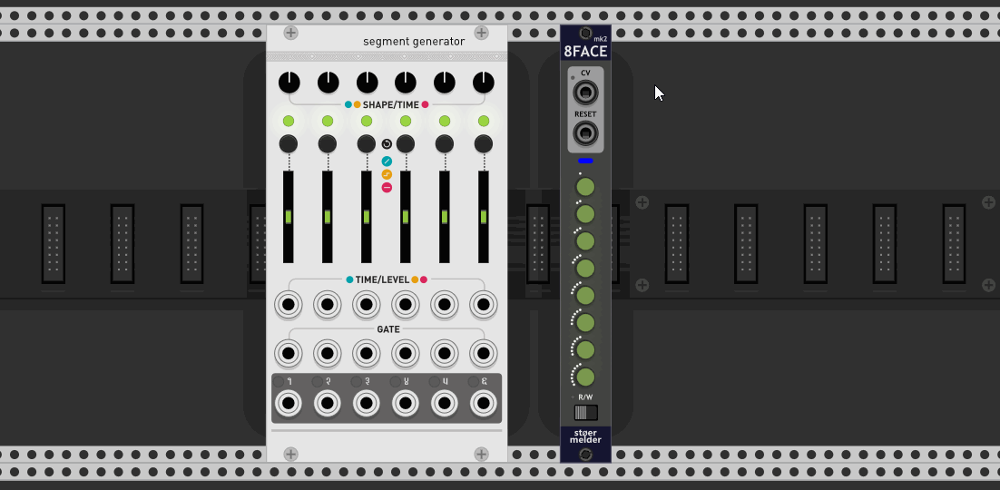
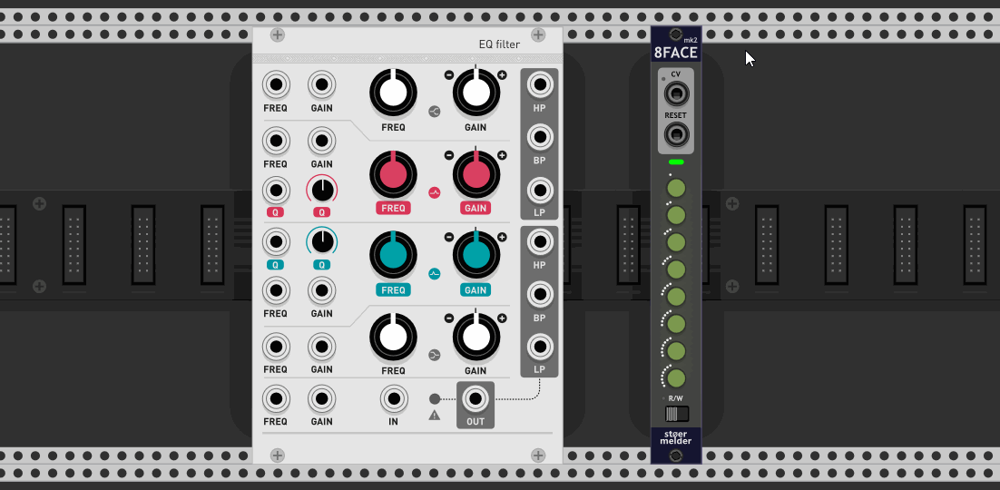
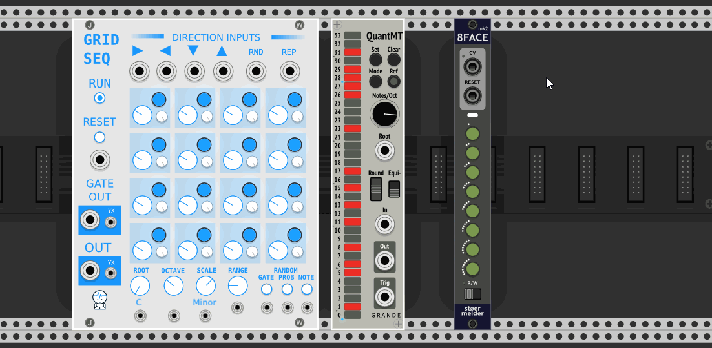
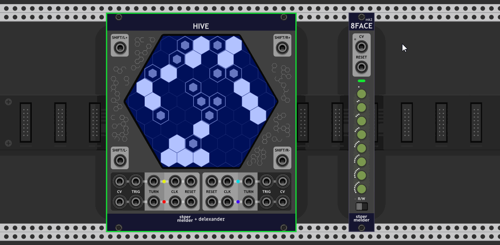
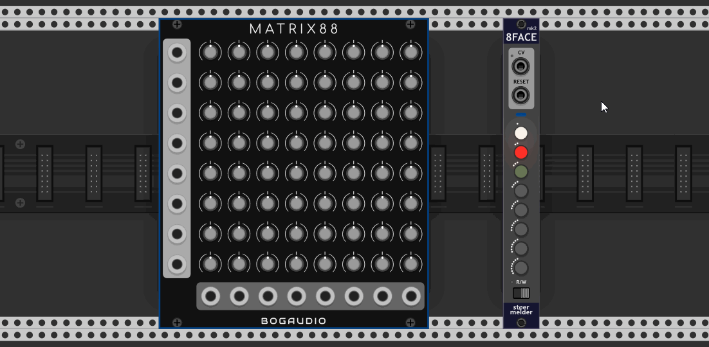
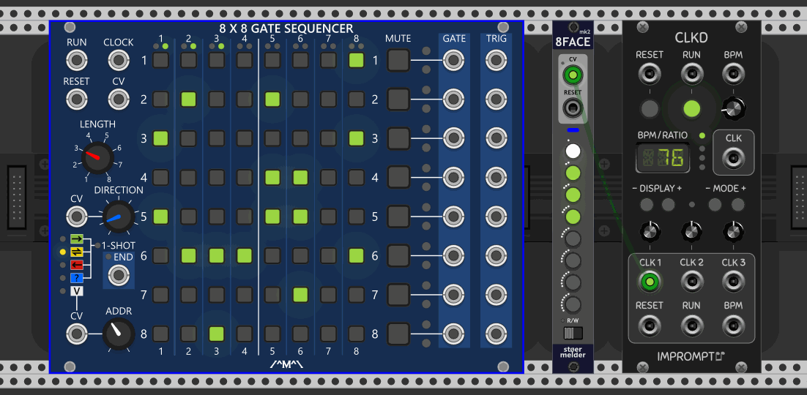

# stoermelder 8FACE mk2

8FACE mk2 is a module for storing, recalling and sequencing different presets of any module in Rack. The _mk2_ version is an evolution of [8FACE](EightFace.md) and provides additional functions, inspired by [TRANSIT](./Transit.md):

- 8FACE mk2 can bind to multiple modules the same time.

- 8FACE mk2 can store up to 64 snapshots by its +8 expander.

**Disclaimer: Loading presets of modules was not designed to be controlled by CV or modulated at audio rate. Please do not contact the developers of Rack or any modules when unexpected behaviour occurs (i.e. crashes) or high CPU usage is noticeable.**

## Binding modules

At least one module must be bound to 8FACE mk2 before the module can be used. It provides two ways for binding modules which need to be enabled on the contextual menu:

- **Bind module (left)**  
  Place any module in Rack to the left of 8FACE mk2. By selecting _Bind module (left)_ the module gets bound by 8FACE mk2.

- **Bind module (select)**  
  Selecting _Bind module (select)_ turns the mouse pointer into a crosshair. After you click on the panel of a module this module gets bound by 8FACE mk2.

8FACE mk2 is designed to bind different modules the same time and technically there is no limitation on the number of modules which can be bound. Please note that loading presets of many modules can increase CPU usage, depending on the complexity of the bound modules.  
Modules can be unbound at any point by context menu option. Please note that presets in snapshots won't be deleted for unbound modules.

All bound modules are decorated with a colored bounding box. The color of the box can be changed in the context menu or it can be disabled completely.

## Saving snapshots in write-mode 

Write-mode is used to save snapshots in 8FACE mk2 after some modules have been bound: A snapshot consists of the presets all bound modules. You enter write-mode by flipping the switch on the bottom to the _W_-position. To store a snapshot simply short press one of the 8 snapshot-buttons and the LED on a snapshot-button is lit in red when a slot is in use. To clear a snapshot long-press the button. 

There are also some options on the context menu of the snapshot-buttons:

- **Load** (also Shift+click)  
  Applies the snapshot to the modules if the slot is used.
- **Clear**  
  Clears the snapshot.
- **Randomize and save**  
  Randomizes all bound modules and saves a snapshot.
- **Copy**  
  Copies the snapshot to the clipboard.
- **Paste**  
  Pastes the snapshot which has been copied before.

A blinking white LED signals the snapshot applied at last. Please keep in mind that you can change bound modules manually which and these changes will not be recognized by 8FACE mk2.  
In write-mode any input on the SEL-port is ignored and sequencing is disabled.

## Sequencing and selecting snapshots

The fun begins when you use the port labelled _SEL_ for selecting snapshots by CV. Although there are 8 snapshot slots available it is possible to use less slots for sequencing: You can adjust the number of active slots (i.e. sequence length) by long-pressing a snapshot-button while in read-mode. The LEDs turn off completely for slots that are currently disabled.

Modes for _SEL_ on the contextual menu:

- **Trigger forward**  
  A trigger advances 8FACE mk2 to the next snapshot. Empty slots are part of the sequence but won't have any effect on the bound modules. A trigger on _RESET_ restarts the sequence on snapshot 1.
- **Trigger reverse**  
  Same as "Trigger forward" but reverse direction.
- **Trigger pingpong**  
  Same as "Trigger forward" but loops first forward then reverse.
- **Trigger alternating**  
  Same as "Trigger forward" but progresses in the following manner (for 6 active snapshots): 1, 2, 1, 3, 1, 4, 1, 5, 1, 6, 1, 5, 1, 4, 1, 3, 1, 2, ...
- **Trigger random**  
  Same as "Trigger forward" but chooses the next snapshot randomly.
- **Trigger pseudo-random**   
  Same as "Trigger random" but never chooses a snapshot multiple times in a row (which happens on "random").
- **Trigger random walk**  
  Same as "Trigger forward" but chooses the next snapshot randomly right next to the currently active snapshot.
- **Trigger shuffle**  
  Same as "Trigger forward" but works on a random permutation of the active snapshots: Every snapshot will be enabled once before the next permutation is randomly generated.
- **0..10V**  
  You can select a specific snapshot by voltage. A voltage 0-0.833V selects slot 1, 0.833-0.166V selects slot 2, and so on, if all 12 snapshot-slots are active. Keep in mind that adjusting the length of the sequence also adjusts the voltage range for selecting individual slots: A sequence with length 2 will select slot 1 on voltage 0-5V etc.
- **C4**  
  This mode follows the V/Oct-standard. C4 selects snapshot 1, C#4 selects snapshot 2 and so on.
- **Arm**  
  This mode is a kind of "buffered trigger": First apply a clock signal on _SEL_. Then you "arm" any snapshot manually or by MIDI-mapping by its button (resulting in a yellow LED) which will be activated on the next clock trigger (white LED). This mode allows you manual snapshot activation synchronized to a clock.

With the option "Autoload first preset" on the context menu you can autoload the first preset slot when a preset of 8FACE mk2 itself is loaded. This is useful when changing presets of 8FACE mk2 with another instance of 8FACE or 8FACE mk2 to aquire even more preset slots. The option "Autoload last active preset" works the same way.

## Tips

- 8FACE mk2 is designed to apply different presets onto modules, while stoermelder [TRANSIT](./Transit.md) is designed to morph parameter-snapshots. Morphing between presets of modules is not possible because of technical reasons.

- Each snapshot can be named with a custom text label. This label is shown while hovering above the snapshot button if parameter tooltips are enabled.

8FACE mk2 was added in v1.9 of PackOne.

# +8 expander

8FACE mk2 provides 8 snapshot-slots and supports extending this number with +8 expanders: The expander must be placed on the right side of 8FACE mk2. Up to seven instances of +8 can be added to one instance of 8FACE mk2, providing 8 * 8 = 64 snapshot-slots in total.  
Once placed next to 8FACE mk2 the expander works and behaves the same way 8FACE mk2 does and the setup is done analogously. +8 itself provides no further options.

+8 was added in v1.9 of PackOne.