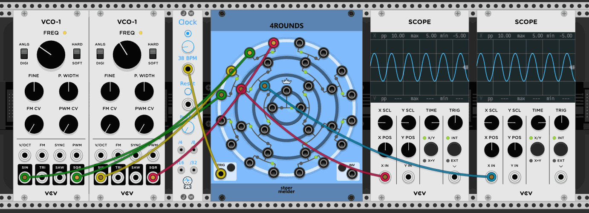

# stoermelder 4ROUNDS

The module 4ROUNDS takes up to 16 input signals and creates several randomly selected outputs. This is done by delivering some sort of contest or tournament between signals and choosing a random winner of 15 "1-on-1 matches". There are four rounds of 1-on-1 matches needed to find a winner hence the name 4ROUNDS. Every pairing of each match is drawn on the panel for easy visual understanding.

### Section TRIG

A new contest is carried out every time a trigger is received. The winners of each 1-on-1 match is selected randomly until only one signal remains.

### Section INV

INV triggers the inversion of the state of the module. The losers of every 1-on-1 match become winners, the winner become losers.

### Modes

The module provides currently three different operation modes:

- In "CV / audio" mode the winning signal of each match is directly routed to each output respectively. Active signals are shown by LEDs lit in green and an inverted state is shown by LEDs lit in red.
- In "Sample & hold" mode just one sample of each input is taken when receiving a trigger on TRIG. Green and red LEDs are used the same way as in "CV / audio" mode.
- In "Quantum" mode there are not just "winners" and "losers" of matches but also every state in between. The output of a match is a randomly weighted mix of both input signals. The LEDs are lit in white signaling the weighting.

