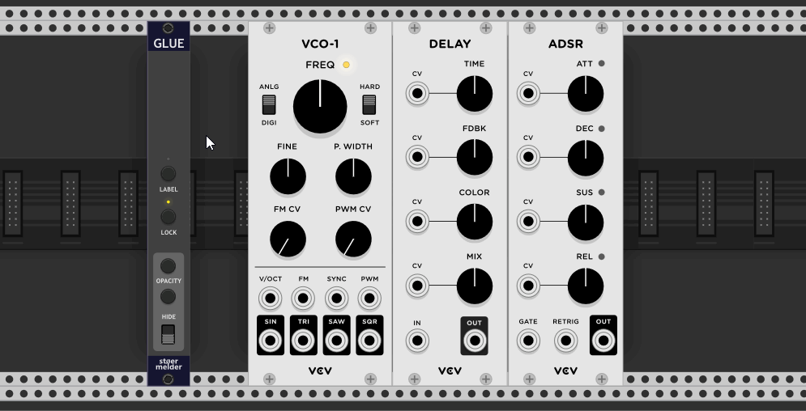
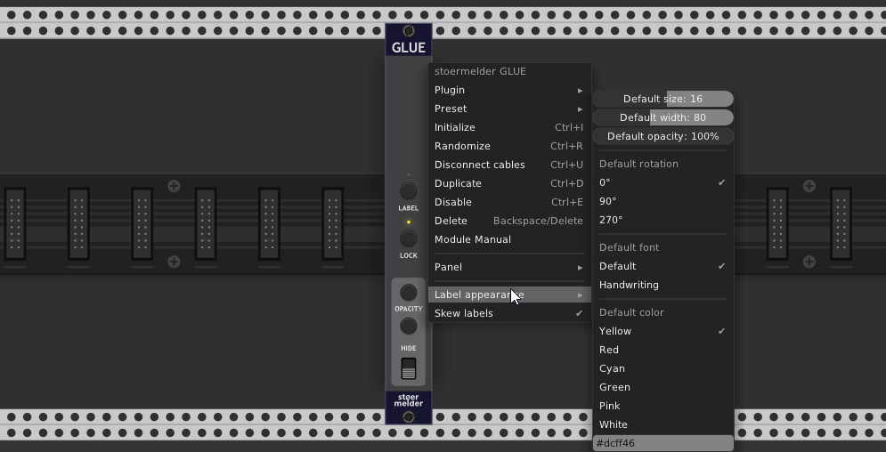
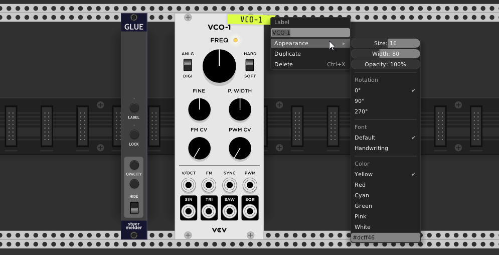

# stoermelder GLUE

GLUE is an utility module that provides the ability to put small text labels on modules in VCV Rack.

### Usage

Labels can be placed after "arming" the labeling-mode with the button *LABEL* (the LED is lit while active) and clicking on any module within your patch. Every label is attached to a specific module and will of course keep its place when moving the module around. After a new label has been placed GLUE "unlocks" itself automatically: In *locked mode* (LED is lit in yellow) all labels are "transparent" for any action and cannot be edited. In *unlocked mode* (LED off) labels can be moved within the boundaries of their modules and can be edited using the context menu.

While in *unlocked mode* you can use the hotkeys CTRL+A to place a label at the current position of the mouse pointer and CTRL+X to remove a label while hovering over it.

### Opacity controls

There are global controls for opacity available which affect all labels of a GLUE instance: *HIDE* hides all labels temporarily, this switch can also be MIDI-mapped. Two buttons on *OPACITY* increase or decrease the opacity of all labels by 5%.

### Default appearance and skew

While each labels keeps its own settings for appearance the module provides default settings which will be applied on every new label. These settings are:
* Size
* Width
* Opacity
* Rotation: 0, 90 or 270 degrees
* Font: Default (typewriter) and Handwriting
* Color: Preset-colors or your own color hexstring (#ffffff)

By default every label gets a small random skew on placement to make it natural looking. If you prefer a clean aligned look skewing can be disabled by context menu option.

### Label appearance

Obviously every label has its own text content which is set with to the module's name by default. All graphical settings which are provided by default from the module can be changed per label afterwards (while *unlocked*).  
The context menu option "Duplicate" arms the labeling mode. Click on any module and create a new label with the same appearance as the duplicated one.

### Bonus tips

* Labels get deleted when a module is removed from Rack
* When undo-ing a delete operation of a module all labels while also reappear
* Duplicating a label won't duplicate its skew
* Duplicating an instace of GLUE won't duplicate any labels
* While a label is strictly attached to a module it can be placed 50% of the labels size outside in any direction
* Labels are drawn above all module components but below cables

GLUE was added in v1.6.0 of PackOne.