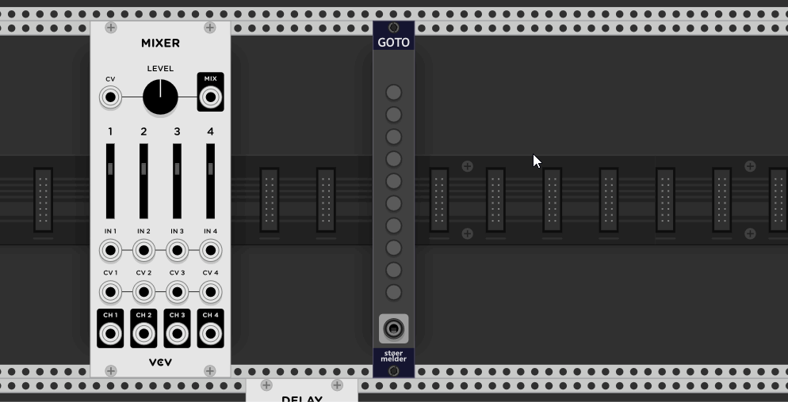
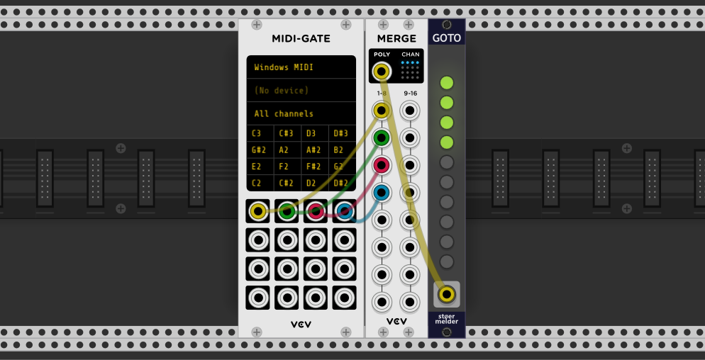

# stoermelder GOTO

GOTO is an utility module which moves the current view-port of VCV Rack to interesting locations in your patch. Up to ten so called "jump points" can be recalled by key-combinations SHIFT+1, SHIFT+2, ... or by CV.

Every jump point of GOTO is bound to a specific module in your patch. The binding procedure is activated by long-pressing one of the buttons (lit in red) and selecting any module by mouse afterwards. Already used jump points are lit in yellow and can be cleared by another long-press on the button. The current zoom level of the view-port is also saved and will be recalled when a jump point is activated.

There are some settings on the context menu available:

* **Jump position**: This option causes the bound module to be centered on the screen or moved to the top left of the screen.
* **Smooth transition**: By default the view-port jumps directly to the bound module. Activating this option moves the view-port smoothly to the new position. Be aware that this utilizes more graphical processing ressources of your system.
* **Ignore zoom level**: By default GOTO recalls the zoom level at binding time. Activating this option leaves the current zoom level untouched.

## _INPUT_-port

It is possible to trigger a view-port change by CV which is especially useful with one of the MIDI-modules, like MIDI-CV, MIDI-GATE or MIDI-CC. As long as a cable is connected to the port the hotkeys SHIFT+1..0 are deactivated. There are two modes available: 

* **Polyphonic trigger**: The first 10 channels of a polyphonic cable are used as triggers for activating jump points 1-10.

* **C5-A5**: the input port is treated as monophonic and the voltages for C5 to A5 according to the V/oct-standard (1.00V-1.83V) trigger jump points 1-10. The module reacts on every change in input voltage.

GOTO was added in v1.6 of PackOne.