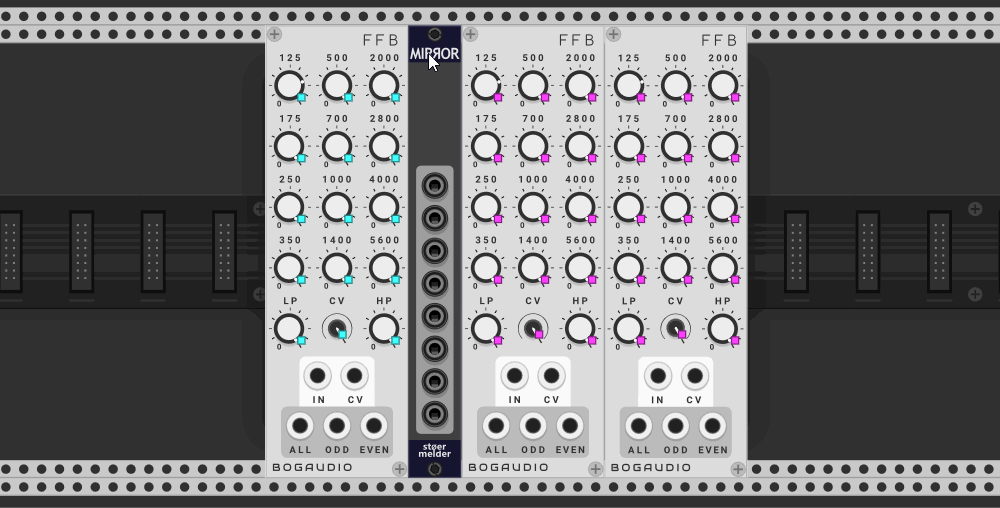
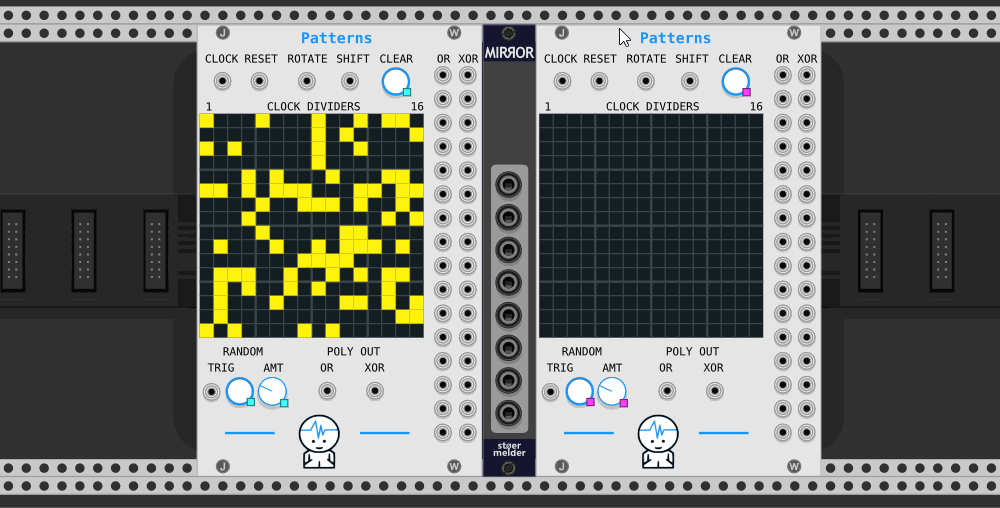

# stoermelder MIRROR

MIRROR is a utility module used for synchronizing parameters of any module across multiple instances of the same module. It is especially useful for monophonic modules in a polyphonic patch and the need to modulate or change all or some parameters the same time with the same amount.

First MIRROR must be bound to another module by placing it directly to the left of MIRROR and using the option "Bind source module (left)". All parameters get mapped by MIRROR. Afterwards you can place another instance of the same module to the right of MIRROR and use the context menu option "Map module (right)" to map all parameters. Each parameter is now linked. You can repeat this procedure or, alternatively you can automatically insert a new instance of the module using "Add and map new module".  
After the modules are bound to the left and right of MIRROR you can place them anywhere in you want in Rack, they don't need to stay directly attached to MIRROR.

It is possible to unmap some parameters if sychronization is not desired. If the parameter is unmapped on the source module all synchronized instances will also drop the mapping. If a parameter is unmapped on a synchronized module only this instance won't mirror the parameter anymore.

### CV-ports

The module has eight input-ports (range 0..10V) which can be dynamically assigned to any parameter of the mapped modules and control it by CV. 

### Presets

Many modules have an internal state which has nothing to do with the parameters on the panel. You can't automatically sync this internal state using MIRROR but you can trigger a manual sync to get all modules into the same initial state.

### Additional features

Mapping many parameters can result in quite high CPU usage. If automation at audio rate is not needed you can disable "Audio rate processing" on the context menu: This way only on every 32th audio sample the mapped parameter is updated and the CPU usage drops to about a 32th.

If you find the mapping indicators distracting you can disable them on the context menu.

MIRROR was added in v1.6.0 of PackOne.