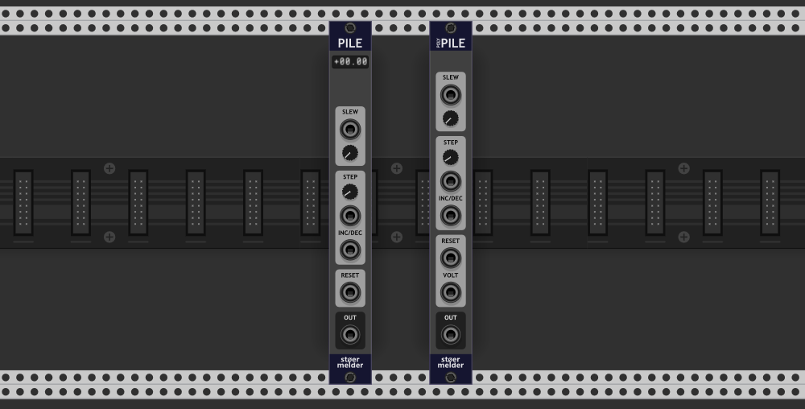
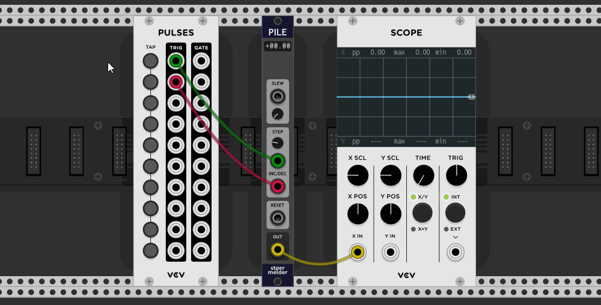
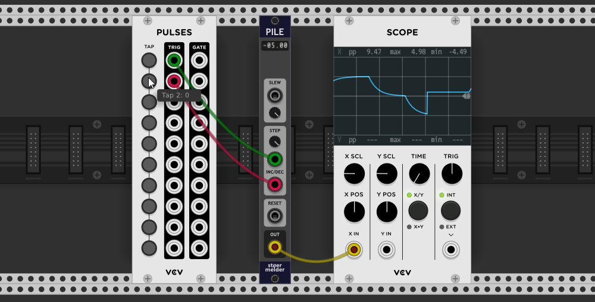

# stoermelder PILE and POLY-PILE

PILE and POLY-PILE are utility modules for conversion of triggers for "increment" and "decrement" into an absolute voltage. PILE is monophonic while POLY-PILE works for polyphonic cables up to 16 channels.

Applying triggers on the ports INC and DEC will increase and decrease, respectively, the output voltage within the selected voltage range with a voltage-jump set on the SIZE-trimpot. Multiple range options for unipolar 0..5V or 0..10V and bipolar -5..5V or -10..10V can be found on the context menu.

### SLEW

By default the output voltage jumps immediately to the target volume. By using the parameter labeled SLEW or its dedicated input-port (range 0..5V) the output slope will be limited with an exponential slew up to 5 seconds.

### RESET

PILE features a single RESET-port which can be used to set the output voltage induced by every input voltage change on RESET.

POLY-PILE features a RESET-port for triggering a reset to 0V if no cable is connected to VOLT. In case of a cable patched to VOLT the output voltage is set to its incoming voltage. While the RESET-port is monophonic the VOLT-port is polyphonic and normalized to the first channel.

### Bonus tips

PILE and POLY-PILE come quite handy together with the module MIDI-STEP which outputs increment and decrement triggers for endless rotary knobs on your MIDI-controller.

PILE was added in v1.5.0 of PackOne. POLY-PILE was added in v1.6.0 of PackOne.