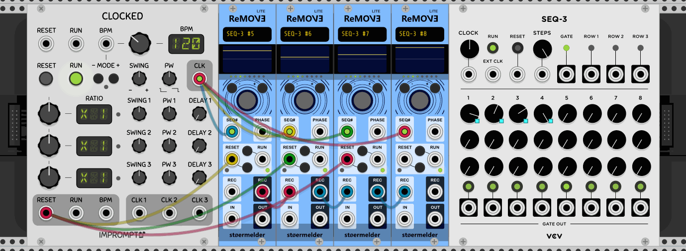
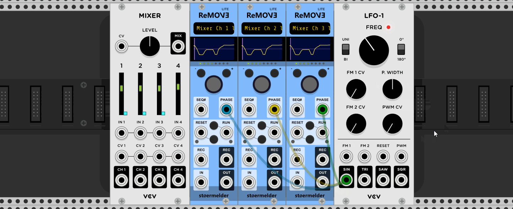
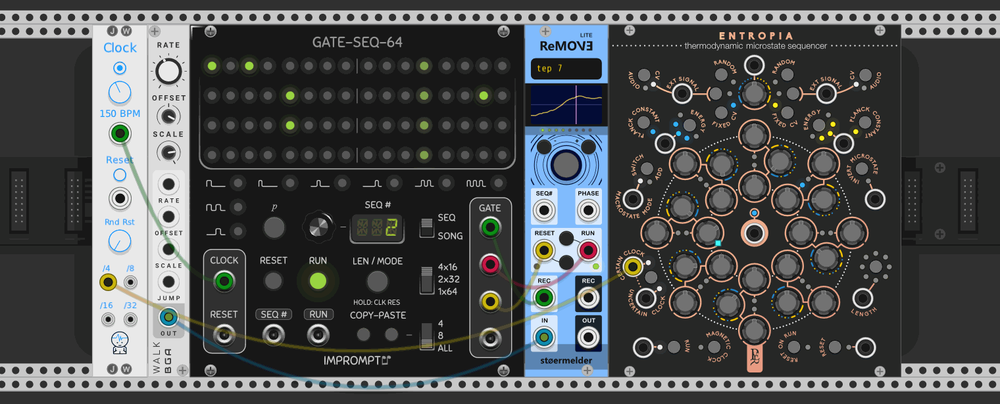
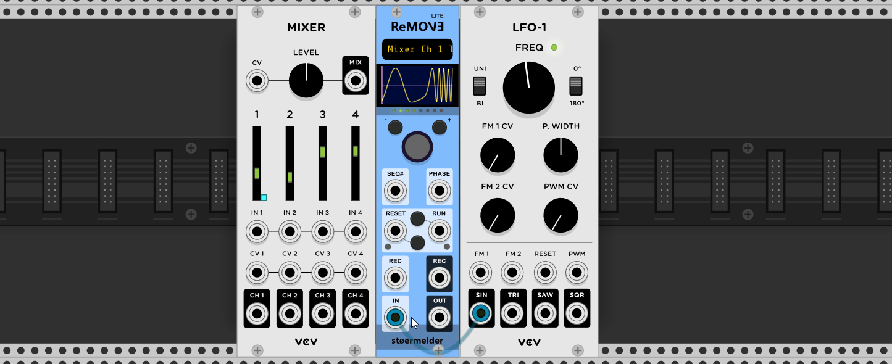

# stoermelder ReMOVE Lite

ReMOVE Lite is a utility module for recording and replaying movements of any parameter on any module in the rack. It supports up to 8 recorded sequences, various  sampling rates, different recording-modes, a phase-input for directly controlling the playback and some more settings. Though it is not its main purpose ReMOVE can be also used as a CV recorder. ReMOVE Lite is monophonic.

A really epic [tutorial video](https://www.youtube.com/watch?v=Dd0EESJhPZA) from [Omri Cohen](https://omricohencomposer.bandcamp.com/) showcasing ReMOVE.

### Mapping of parameters

To map the module to a parameter first activate the mapping mode by mouse press inside the display on the top. While showing "Mapping..." click on any parameter of any module in your rack to bind the module. You can unbind the parameter using the context menu of the display. Also, you can "locate" the module and mapped parameter if you got lost inside you rack.

### Sample rate and number of sequences

The module has built-in storage for 64k samples. At full audio samplerate of 48kHz this corresponds to 1.3 seconds of recording. Such high precision is not needed for parameter automation, so ReMOVE Lite allows at most sampling at rate of 2kHz. The lowest setting is 15Hz and gives you 15 samples per second what could still be ok for slowly changing parameters or low timing accuracy.
Be careful using higher sample rates: Recorded sequences are stored inside the patch and these can get quite huge if several modules are used (to be precise: 64k samples each 4 byte size plus overhead for storing in JSON format, results in 2-3MB).

ReMOVE Lite can be configured to record 1, 2, 4 or 8 different sequences. The maximum length for each sequence is evenly divided, so you get 1/8 of the available recording time when using 8 sequences. The available recording time is shown in the context menu-option and in the display as soon as a recording starts. Be careful: Changing the number of sequences resets all recorded automation data.

Both settings for samplerate and number of sequences can be found in the context menu.

### Recording-Modes

There are three different recording modes available, changed by a context menu option:

- Touch-Mode (Default):
Triggering the red REC button by mouse or through REC-port arms recording. Actual recording of automation data starts on first mouse click ("touch") on the mapped parameter and holds on as long the button is pressed. Recording stops when the mouse button is released.
- Move-Mode:
Similar to Touch-Mode recording is armed when clicking on REC. Recording starts on the first change of the mapped parameter, which happens not necessarily on the mouse down event. Releasing the mouse button ends the recording and the stored automation data will be trimmed on the end to the last change of value. This way the sequence starts on first change and ends on the last one.
- Manual-Mode:
This mode starts the recording as soon as the red REC-button is pressed. Manual-mode is especially useful when triggering using REC-input.
- Sample & Hold-Mode (added in v1.0.4):
This mode records one sample of the currently set parameter value. Useful for sequencing a parameter value in combination with play mode "Loop Sequences".

Recording is only possible when a parameter is mapped, even when using the IN-port.

### Play-Modes

Some modes for playback have been implemented:

- Loop (Default): playback loops through the selected sequence.
- Oneshot: the sequence is played once and must be retriggered by RESET.
- Ping Pong: the sequence loops, first played forward and then backward.
- Loop Sequences (added in v1.0.4): playback loops through all sequences.

You can use the PHASE-input if you want a different playback speed or a completely different playback pattern.

### SEQ#-input

The SEQ#-input allows you to select sequences by CV. There are three different modes available:

- 0..10V (Default): The range is splitted evenly by 8. 0-1.25V selects sequence 1, 1.25-2.5V sequence 2 and so on.
- C4-G4: Keyboard mode, C4 triggers sequence 1, G4 triggers sequence 8.
- Trigger: When a trigger is received the module advances to the next sequence.

### PHASE-input

The input labeled PHASE accepts 0-10V and allows controlling the playhead directly: The voltages from 0 to 10V are mapped to the the length of the sequence. Using an LFO's unipolar saw output or a clock with phase output like [ZZC's Clock-module](https://zzc-cv.github.io/en/clock-manipulation/clock) the playback can be synced to sequencers and you get behaviour of Loop-mode, an LFO with triangle-output gives you ping ping-playback. Obviously multiple instances of the module can also be synchronized this way.

The ports RUN and RESET and their buttons are disabled and can't be used as long a cable is connected to PHASE. From v1.0.4 on this is signaled by red LEDs next to the ports.

### RESET- and RUN-ports

Same behaviour as most sequencers: RUN can be configured for playback as "high" or "trigger", a trigger on RESET restarts the currently selected playback mode from the beginning. Disabled when currently recording or when PHASE-input is connected.

Using ReMOVE in a sequencer scenario that records a random source and plays it back multiple times.

### REC-input

REC-input is used for starting and stopping recordings by CV trigger. Be aware that a trigger with record modes "Touch" and "Move" arms the recording only.

### REC-output

The REC-output can be configured as "gate" or "trigger" everytime a recording starts or stops.

### IN-input

The input labled IN accepts 0..10V or -5..5V (configuration option is found in the context menu) and can be used to record parameter automation data from any external CV source. All parameter movements are ignored during a recording when a cable is connected to this port.

### OUT-output

The OUT-port outputs voltage for the recorded sequence. It can be configured for 0..10V or -5..5V. Since v1.0.4 it outputs also CV while recording for monitoring purposes.

### Bonus-Features

- When duplicating an instance of the module all recorded sequences are also duplicated.
- The module can be re-mapped to another parameter after a sequence has been recorded.
- When changing the sampling rate of the module all recorded data will prevail and the playback-speed will be higher or slower.
- A simple compression is implemented to reduce the size of the patchfile.
