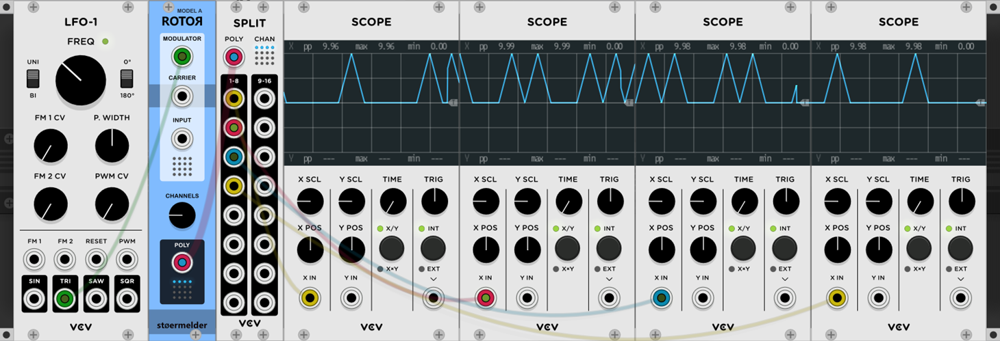

# stoermelder ROTOR Model A

This module modulates a carrier signal across several output channels. 

### MODULATOR-port

The Modulator input is mandatory and defines how the carrier signal is modulated accross the output channels. It must be unipolar (0V-10V) and monophonic. When the channel knob is set to 4, an input voltage in the range 0V-2.5V (=10V / 4 channels) outputs the carrier on channel 1 with attenuation in respect to the voltage between 0V and 2.5V. So, 0V outputs 100% of the carrier, 1.25V outputs 50% of the carrier and 2.5V (and above) 0%. Also, an input voltage of 1.25V outputs 50% of the carrier on channel 2.

### CARRIER-port

The input is optional and monophonic. When no cable is connected a constant voltage of 10V is assumed.

### INPUT-port

The input is optional and polyphonic. An input signal on channel x will be on the output on channel x after it is attenuated with the carrier signal of channel x. An unconnected channel will be ignored.

### OUTPUT-port

The "Channels" knob controls how many output channels are used.